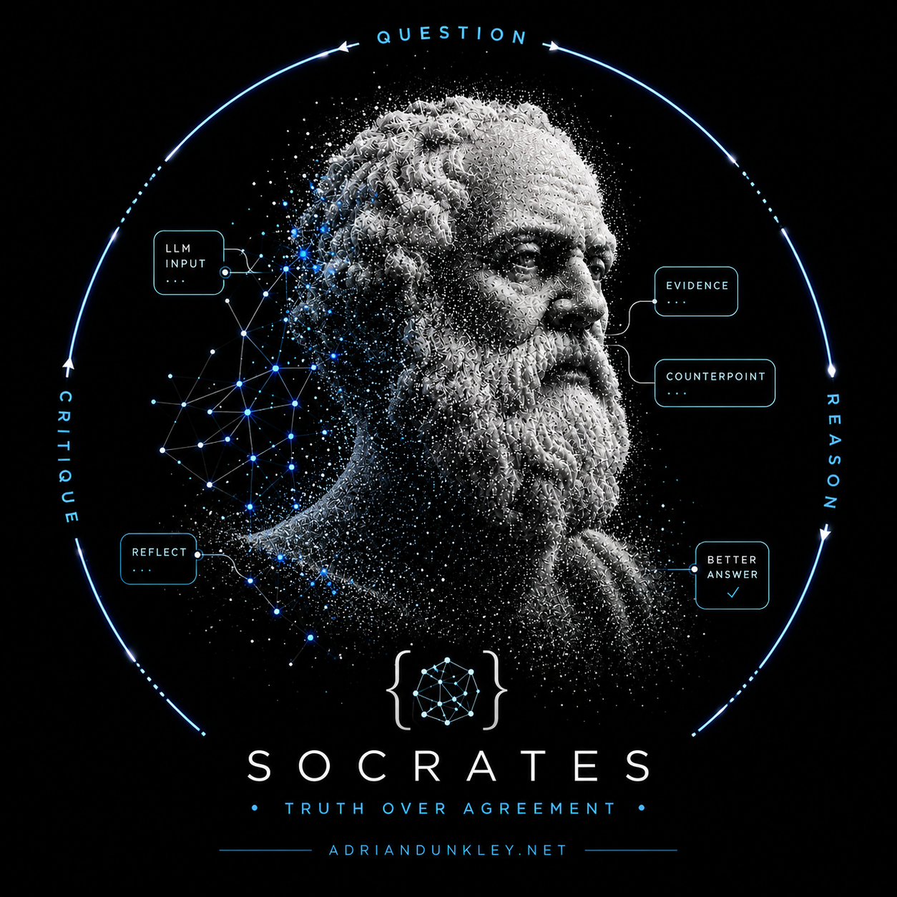

<p align="center">
  
</p>

<h1 align="center">Socrates</h1>

<p align="center"><strong>Stop agreeing. Start reasoning.</strong></p>

<p align="center">
  An open-source toolkit for reducing AI sycophancy through recursive
  self-critique, Socratic questioning, adversarial review, confidence
  calibration, and evidence verification.
</p>

<p align="center">
  <a href="#install">Install</a> ·
  <a href="#the-skills">Claude / ChatGPT / Gemini</a> ·
  <a href="#the-python-framework">Python framework</a> ·
  <a href="#how-it-works">How it works</a> ·
  <a href="LICENSE">Apache-2.0</a>
</p>

---

## Why

Large language models are trained to be helpful — and that training quietly
teaches them to **agree**. They flatter, they validate shaky premises, they
state guesses as facts, and they repeat figures and quotes without checking
them. That is *sycophancy*, and it is dangerous precisely when you most need
the truth.

**Socrates** flips the default. It makes a model behave like a wise Socratic
examiner: curious, intellectually honest, non-flattering, evidence-oriented,
calibrated, and willing to disagree with you when the evidence demands it.

It ships in four forms that share **one methodology**:

| Surface | What it is | Where |
|---|---|---|
| 🟣 **Claude Skill** | A drop-in `SKILL.md` for Claude / Claude Code | [`skills/claude`](skills/claude) |
| 🟢 **ChatGPT Skill** | Custom-GPT instructions + a system prompt | [`skills/chatgpt`](skills/chatgpt) |
| 🔵 **Gemini Gem** | A ready-to-paste Gem definition | [`skills/gemini`](skills/gemini) |
| 🐍 **Python framework** | `socrates-ai` — provider-agnostic engine + CLI | [`src/socrates`](src/socrates) |

---

## The method

Before answering, Socrates runs five disciplines:

1. **Truth-seeking draft** — answer honestly first; address false premises head-on.
2. **Recursive self-critique** — interrogate the draft with hard Socratic questions, then revise. Repeat.
3. **Adversarial review** — red-team the answer for errors, overconfidence, and sycophancy.
4. **Evidence verification** — extract every figure, quote, and attribution and **check it**, catching misquotes, misattributions, and misrepresented facts.
5. **Calibration & respectful disagreement** — state how confident it is and why, and push back on the user when warranted.

---

## Install

### Python framework

```bash
# core (no heavy deps)
pip install socrates-ai

# with the provider SDK you want
pip install "socrates-ai[anthropic]"   # Claude
pip install "socrates-ai[openai]"      # ChatGPT
pip install "socrates-ai[gemini]"      # Gemini
pip install "socrates-ai[all]"         # everything
```

Or from source:

```bash
git clone https://github.com/caribbeanai/socrates.git
cd socrates
pip install -e ".[all,dev]"
```

### Skills / Gem

No install — see the per-surface instructions:
[Claude](skills/claude/README.md) · [ChatGPT](skills/chatgpt/README.md) · [Gemini](skills/gemini/README.md).

---

## The Python framework

```python
from socrates import Socrates
from socrates.providers import AnthropicProvider

socrates = Socrates(provider=AnthropicProvider())   # defaults to Claude Opus 4.8

result = socrates.reason(
    "Did Einstein say 'imagination is more important than knowledge'?"
)

print(result.final_answer)
print(result.confidence.level, f"{result.confidence.score:.0%}")
for v in result.flagged_claims:
    print("⚠️", v.claim.text, "→", v.status.value)
```

### Verifying figures, quotes, and facts

Plug in **any** search backend — a function, an object with a `.search()`
method, or your existing retrieval stack. Without one, checkable claims are
honestly marked `unverified` rather than silently trusted.

```python
def my_search(query: str):
    # return dicts, strings, or socrates.verification.SearchResult objects
    return [{"title": "...", "snippet": "...", "url": "..."}]

socrates = Socrates(provider=AnthropicProvider(), search=my_search)
result = socrates.reason("Our deck says the market grew 40% YoY — is that right?")
print(result.to_markdown())
```

### Use any provider

```python
from socrates.providers import OpenAIProvider, GeminiProvider

Socrates(provider=OpenAIProvider(model="gpt-4o"))
Socrates(provider=GeminiProvider(model="gemini-1.5-pro"))
```

Bring your own by subclassing `socrates.providers.base.Provider` (one method:
`complete(system, prompt, max_tokens)`).

### CLI

```bash
socrates "Is my startup idea obviously good?"
socrates --provider openai --rounds 3 "Review this claim: GDP grew 12% last year"
echo "Summarize and fact-check this article: ..." | socrates --json
```

```
socrates [-p anthropic|openai|gemini] [-m MODEL] [-r ROUNDS]
         [--context TEXT] [--no-verify] [--json] [QUESTION]
```

---

## The skills

Each surface implements the **same** five-discipline protocol so behaviour is
consistent whether you're in Claude, ChatGPT, Gemini, or Python.

- **Claude** — copy [`skills/claude/SKILL.md`](skills/claude/SKILL.md) into your
  project's `.claude/skills/socrates/` directory (or a personal skill folder).
  See the [setup guide](skills/claude/README.md).
- **ChatGPT** — paste [`skills/chatgpt/instructions.md`](skills/chatgpt/instructions.md)
  into a Custom GPT's *Instructions*, or use it as a system prompt via the API.
  See the [setup guide](skills/chatgpt/README.md).
- **Gemini** — paste [`skills/gemini/GEM.md`](skills/gemini/GEM.md) into a new
  Gem in Google's Gem manager. See the [setup guide](skills/gemini/README.md).

---

## How it works

```
        ┌──────────┐
 you ──▶│  DRAFT   │  honest first answer; confront false premises
        └────┬─────┘
             ▼
        ┌──────────────────────┐
        │ RECURSIVE SELF-CRITIQUE│  Socratic questions → revise → repeat
        └────┬──────────────────┘
             ▼
        ┌──────────────────┐
        │ ADVERSARIAL REVIEW│  red-team for error & sycophancy
        └────┬──────────────┘
             ▼
        ┌──────────────────┐
        │ VERIFY CLAIMS     │  figures · quotes · attributions · facts
        └────┬──────────────┘
             ▼
        ┌──────────────────────────┐
        │ SYNTHESIS + CALIBRATION   │  correct, de-flatter, state confidence,
        └────┬──────────────────────┘  disagree respectfully
             ▼
      calibrated, evidence-checked answer
```

Calibration is not just the model's mood: refuted claims, misattributions,
unresolved critiques, and unverified figures each pull the final confidence
score down (see [`calibration.py`](src/socrates/calibration.py)).

---

## Development

```bash
pip install -e ".[all,dev]"
pytest            # full offline test suite (no API keys needed)
ruff check .      # lint
mypy              # type-check
```

The test suite drives the entire pipeline through a scripted offline
provider, so it runs without network access or credentials.

---

## Contributing

This is a single-maintainer project by **Adrian Dunkley**
([@caribbeanai](https://github.com/caribbeanai) · [adriandunkley.net](https://adriandunkley.net)).
Issues and discussion are welcome; please read [CONTRIBUTING.md](CONTRIBUTING.md).

## License

[Apache License 2.0](LICENSE) © Adrian Dunkley.
